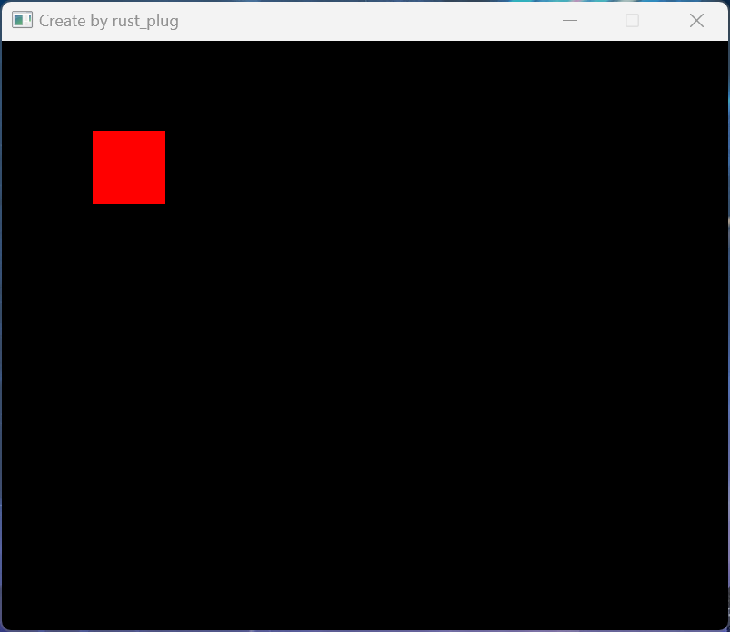

# Rust Plug

## Quick Start

```bash
cargo run `your_dynamic_library_name` [--release]
```

for example, if your dynamic library is named `libmylib.so`, you can run:

```bash
cargo run libmylib.so [--release]
```

- then you can use the functions provided by your dynamic library in your terminal with simple REPL.

## Notice

- Recently we only support parsing into *i32*, *f64* *c_str*, also parsing 32bit hex into *u32*.

- Recently not yet support to print the return value of functions.

- If you encounter any issues, please check the [GitHub repository](https://github.com/HuaGu-Dragon/RustPlug) for more information or open an issue.

## Usage

For example, in [math](./math/src/lib.rs) has following functions:

```rust
#[unsafe(no_mangle)]
pub extern "C" fn add(left: i32, right: i32) -> i32 {
    let res = left + right;
    println!("{left} + {right} = {res}");
    res
}

#[unsafe(no_mangle)]
pub extern "C" fn sub(left: i32, right: i32) -> i32 {
    let res = left - right;
    println!("{left} - {right} = {res}");
    res
}
```

you can use them in your terminal with simple REPL, like

```bash
add 1 2
sub 3 4
```

- then the functions will be executed and the results will be printed.

## Funny Usage

call the raylib to create a window and draw a rectangle:



```bash
InitWindow 800 650 "Create by rust_plug"
BeginDrawing
DrawRectangle 100 100 80 80 0xFF0000FF
EndDrawing
CloseWindow
:q
```

- Notice, that 0xFF0000FF is a hex color code for red. but it's ABGR, not RGBA. Because of the endianness of the CPU architecture, raylib use a struct with four u8, but we parse hex color code as u32.
